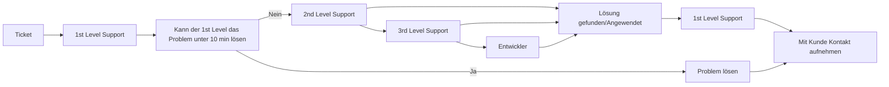
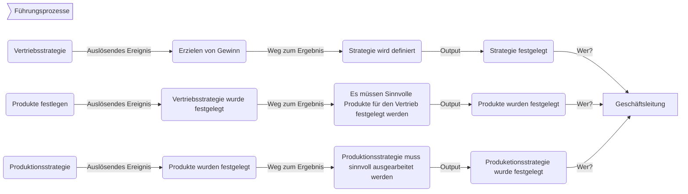
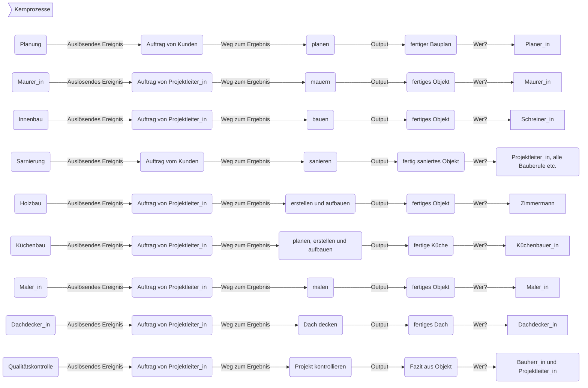
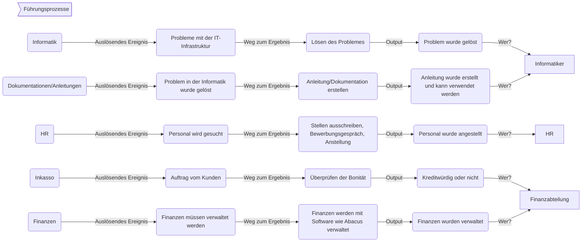

M254 - Geschäftsprozesse beschreiben

# M254 - Geschäftsprozesse beschreiben

Im ganzen Modul werden wir uns mit der **GLB**  **Genossenschaft** auseinandersetzen.

**Autoren:** Lino Steffen &amp; Linus Moser

**Klasse:** Inf2021c

Version 5

**Table of Contents**

Block 1 - Aufbauorganisation

Block 2 - Ablauforganisation

Block 3 - Grundlagen Geschäftsprozesse

Block 4 - Prozessarten und ihre Abhängigkeit

Block 5 - BPMN

Block 6 -

Block 7 -

# Block 1 - Aufbauorganisation

## Organigramm GLB Gruppe KR1.1

# Block 2 - Ablauforganisation

Bei diesem Block behandeln wir den Ticketprozess der GLB Informatik

## Karteikartenmethode KR.1.2

Ticket vom Kunden kommt rein.

1st. Level nimmt das Ticket an.

Kann das Ticket in unter 10 Minuten bearbeitet werden, muss dies gemacht werden.

Ansonsten gibt man es dem 2nd Level weiter. Löst er(2nd, 3rd, Entwickler) das, gibt er dem 1st Level Supporter das Ticket zurück und der schaut mit dem Kunden. Dies ist in jedem Fall (3rd,Entwickler) so. Kann der 2nd das Ticket nicht lösen, bekommt es der 3rd Level Supporter. Kann dieser das Ticket nicht lösen, muss der 3rd Level Supporter Kontakt mit den Entwickler aufnehmen.

## Bildkartenmethode KR.1.2

# Block 3 - Grundlagen Geschäftsprozesse

## Kernprozess Zimmermann KR1.3

1. Planen
1. Vorstellen
1. Anpassen
1. Kaufen
1. Teile bauen
1. Zu Baustelle liefern
1. Zusammenbauen
1. weiter z. B. zu Dachdecker

# Block 4 - Prozessarten und ihre Abhängigkeit

## Prozesslandkarte KR1.4

### Lieferobjekte der Prozesslandkarte

## Prozesslandkarte mit Verbindungen KR1.5

# Block 5 - BPMN

## BPMN Supportprozess - Ticket bearbeiten (KR2.1 und KR2.2)

## BPMN Kernprozess - Zimmermann (KR2.3)

## BPMN Führungsprozess - Produkte definieren (KR2.3)
