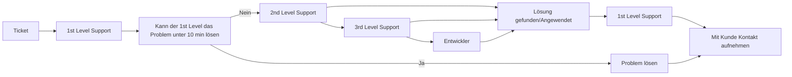
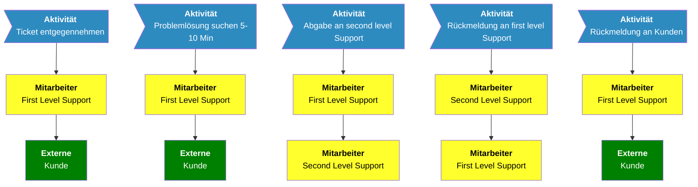

# M254 - Geschäftsprozesse beschreiben

Im ganzen Modul werden wir uns mit der GLB Genossenschaft auseinandersetzen.

**Table of Contents**

Block 1 - Aufbauorganisation

Block 2 - Ablauforganisation

Block 3 - Grundlagen Geschäftsprozesse

# Block 1 - Aufbauorganisation

## Organigramm GLB Gruppe:

# Block 2 - Ablauforganisation

Bei diesem Block behandeln wir den Ticketprozess der GLB Informatik

## Karteikartenmethode

Ticket vom Kunden kommt rein.

1st. Level nimmt das Ticket an.

Kann das Ticket in unter 10 Minuten bearbeitet werden, muss dies gemacht werden.

Ansonsten gibt man es dem 2nd Level weiter. Löst er(2nd, 3rd, Entwickler) das, gibt er dem 1st Level Supporter das Ticket zurück und der schaut mit dem Kunden. Dies ist in jedem Fall (3rd,Entwickler) so. Kann der 2nd das Ticket nicht lösen, bekommt es der 3rd Level Supporter. Kann dieser das Ticket nicht lösen, muss der 3rd Level Supporter Kontakt mit den Entwickler aufnehmen.

## Bildkartenmethode

# Block 3 - Grundlagen Geschäftsprozesse

## Kernprozess Zimmermann

1. Planen
1. Vorstellen
1. Anpassen
1. Kaufen
1. Teile bauen
1. Zu Baustelle liefern
1. Zusammenbauen
1. weiter z. B. zu Dachdecker

